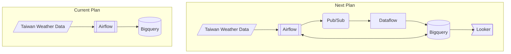
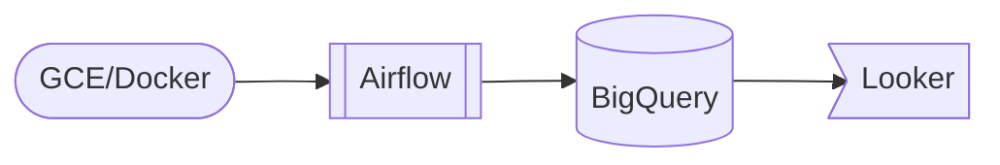
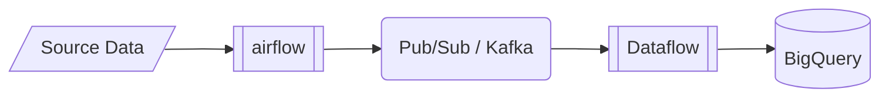
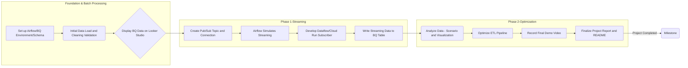

gcp-airflow-data-pipeline
===
GCP Architecture Side Project: An End-to-End pipeline developed to bridge architecture experience gaps. Practices cloud-native ETL using Airflow orchestration, and BigQuery DWH for integrating external weather Data.

## Architecture & Data Flow



### Present: Batch Processing

#### Current Architecture (Batch ETL)

The current data pipeline uses the **Airflow Batch Processing** mode:
1. **Data Source:** Taiwan historical weather data (https://ci.taiwan.gov.tw/dsp/Views/dataset/weather.aspx).
2. **Extract/Load:** The Airflow DAG runs a Python script inside a GCE container. It writes data directly to the **RAW Table** in BigQuery.
3. [TODO] **Transform:** The Airflow DAG runs BigQuery DML/DDL queries for data cleaning and analysis.
4. [TODO] **Visualization:** Show basic information on a dashboard.


### Future: Streaming

#### Next Plan Architecture (Streaming)

To handle a lot of data quickly (high throughput) or real-time data, I plan to use a message queue next:
* **Data Source $\to$ Pub/Sub:** The weather data will be sent to **GCP Pub/Sub**. This will be used as a data buffer.
* **Data Processing:** I plan to use **Cloud Dataflow** or **Cloud Run (Subscriber Service)** to read from the Pub/Sub topic. After small data changes, it will write the data to BigQuery using streaming.
* **Goal:** To get data together with low delay (low latency) and high scalability.


## Tech Stack & Tools
* **Cloud Platform:** Google Cloud Platform (GCP)
* **Orchestration & Scheduling:** Apache Airflow 3.1.0 (Docker Compose on GCE)
* **Data Warehouse:** Google BigQuery (BQ)
* **Programming Languages:** Python 3.12+, SQL (BigQuery DML/DDL)

## Core DAGs & BQ Mastery

* **DAGs Location:** `./dags/`
* **Business Logic Modules:** `./modules/`

| DAG ID | Purpose |
| :--- | :--- |
| `weather_data_etl_taskflow` | Fetch historical weather data and load it to the raw_table in BigQuery.|


## Deployment Guide
#### 5.1 Environment Requirements
  * GCP Project (Compute Engine, BigQuery API must be enabled)
  * Docker and Docker Compose installed locally or on GCE
  * Need a **Service Account** to access BigQuery or configured **gcloud default credentials**.

#### 5.2 GCE VM Configuration
1. **VM Config:** I suggest using `e2-standard-2` (2 vCPU, 8GB RAM) or higher (Airflow needs at least 4GB).
2. **SSH Stability:** Set up a **Static External IP** $\to$ This helps fix the problem of the IP changing after a restart.

#### 5.3 Start Airflow
  1.  **Clone Project:**
      ```bash
      git clone https://github.com/windycloud12/gcp-airflow-data-pipeline.git
      cd gcp-airflow-data-pipeline
      ```
      
  2. **Environment Variables:**
     - **Rename:** .env.example -> .env
     - **Setup:** Please set the values according to your GCP project.
     
  3.  **Start:**
      ```bash
      docker compose up -d
      ```

## Project Phases



###### tags: `Airflow` `GCP` `ELT`
